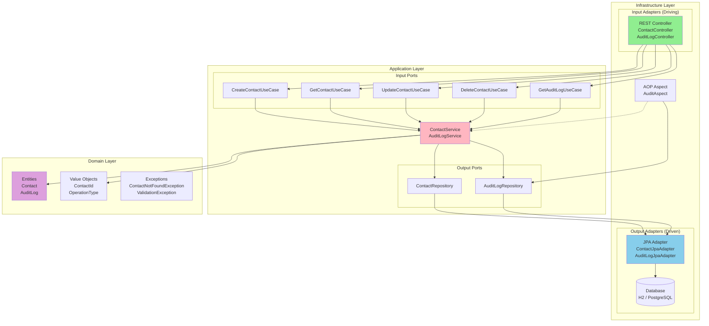
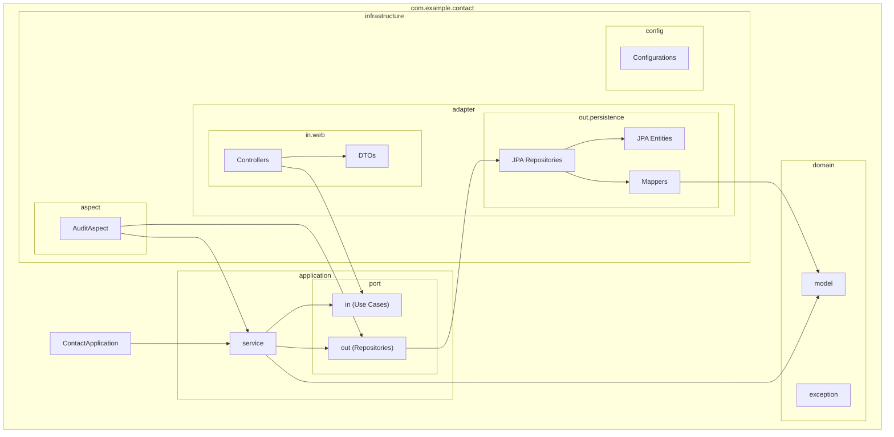
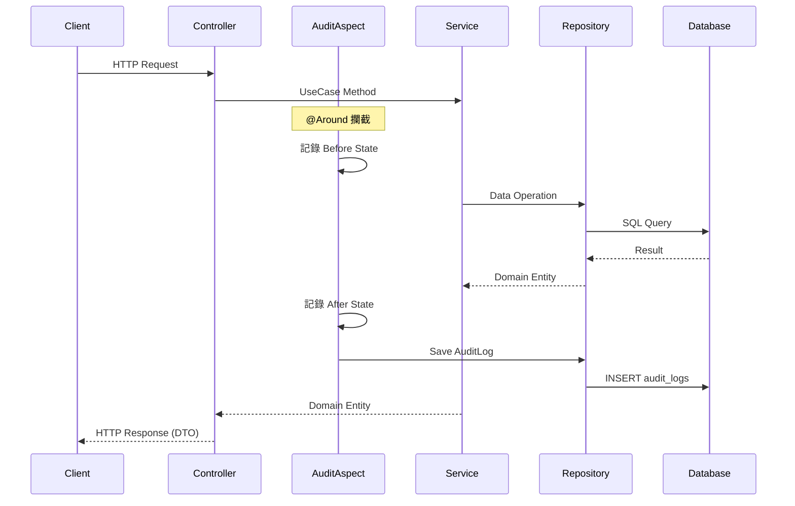
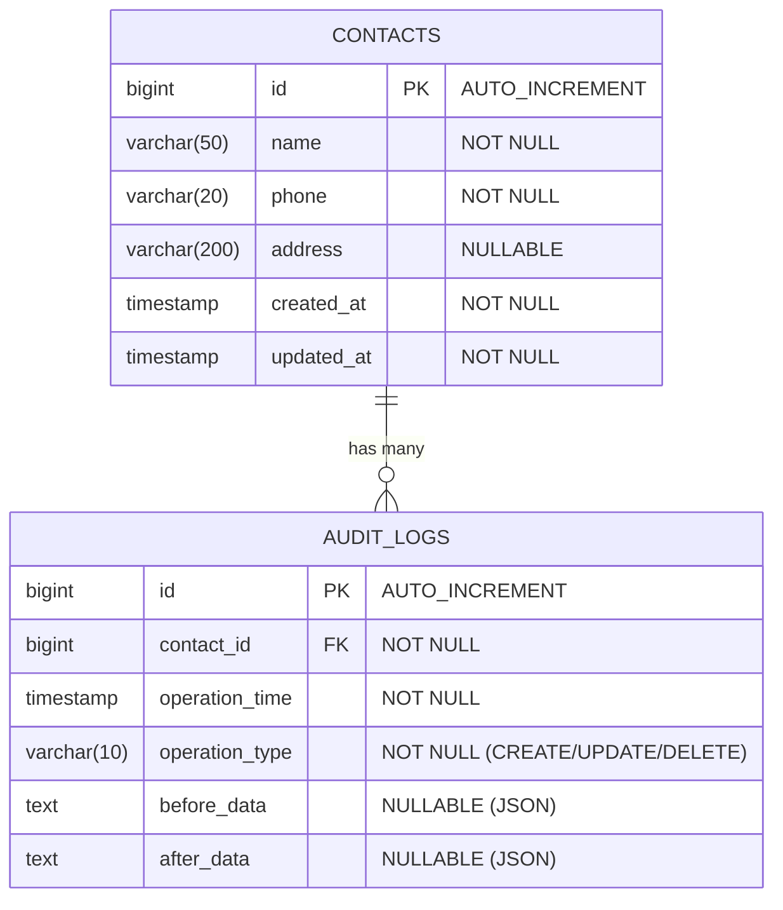
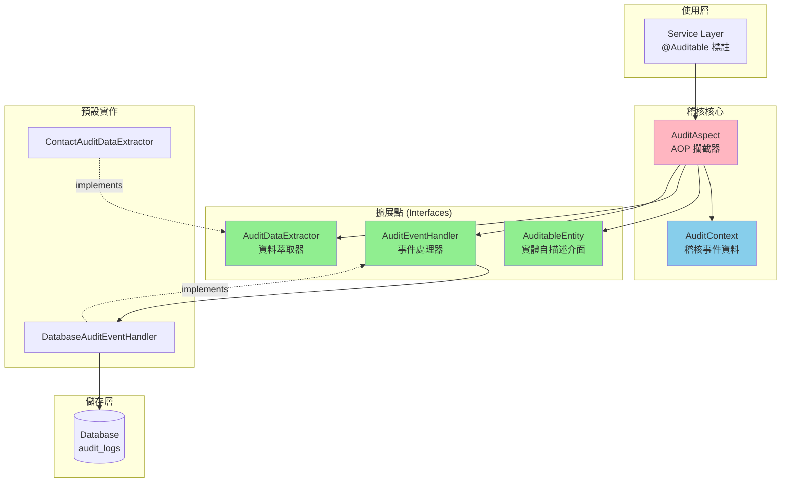

# 聯絡人管理系統 (Contact Management System)

基於六角形架構 (Hexagonal Architecture) 的 RESTful API 聯絡人管理系統，具備完整的 CRUD 操作與 AOP 自動稽核日誌功能。

## 專案狀態

| 項目 | 狀態 |
|------|------|
| 建置狀態 | ✅ BUILD SUCCESSFUL |
| 測試覆蓋 | ✅ 39 tests passed |
| API 文件 | ✅ Swagger UI 可用 |
| 開發環境 | ✅ H2 Console 可用 |

### 已實作功能

- [x] **US1**: 新增聯絡人 - POST /api/contacts
- [x] **US2**: 查詢聯絡人 - GET /api/contacts, GET /api/contacts/{id}
- [x] **US3**: 修改聯絡人 - PUT /api/contacts/{id}
- [x] **US4**: 刪除聯絡人 - DELETE /api/contacts/{id}
- [x] **US5**: 稽核日誌自動記錄 - AOP 自動攔截
- [x] **US6**: 稽核日誌查詢 - GET /api/audit-logs
- [x] **US7**: H2 資料庫管理介面

## 技術棧

| 技術 | 版本 | 用途 |
|------|------|------|
| Java | 17 | 程式語言 |
| Spring Boot | 3.2.0 | 應用框架 |
| Spring Data JPA | 3.2.0 | 資料存取 |
| Spring AOP | 3.2.0 | 切面程式設計 |
| H2 Database | - | 開發環境資料庫 |
| PostgreSQL | - | 生產環境資料庫 |
| Cucumber | 7.15.0 | BDD 測試 |
| Springdoc OpenAPI | 2.3.0 | API 文件 |
| Gradle | 8.5 | 建置工具 |

## 系統架構

### 六角形架構 (Hexagonal Architecture)



### 套件結構圖



### 請求處理流程



## ER Diagram



## 快速開始

### 環境需求

- JDK 17+
- Gradle 8.5+ (使用 wrapper 可略過)

### 啟動專案

```bash
# 1. Clone 專案
git clone <repository-url>
cd aop-poc

# 2. 建置專案
./gradlew build

# 3. 啟動應用程式 (開發環境)
./gradlew bootRun --args='--spring.profiles.active=dev'
```

### 存取服務

| 服務 | URL |
|------|-----|
| API Base URL | http://localhost:8080/api |
| Swagger UI | http://localhost:8080/swagger-ui.html |
| OpenAPI JSON | http://localhost:8080/v3/api-docs |
| H2 Console | http://localhost:8080/h2-console |

#### H2 Console 連線資訊

- JDBC URL: `jdbc:h2:mem:contactdb`
- Username: `sa`
- Password: (空白)

## API 使用指南

### 聯絡人 API

#### 1. 新增聯絡人

```bash
curl -X POST http://localhost:8080/api/contacts \
  -H "Content-Type: application/json" \
  -d '{
    "name": "王小明",
    "phone": "0912345678",
    "address": "台北市信義區信義路五段7號"
  }'
```

**回應範例 (201 Created):**

```json
{
  "id": 1,
  "name": "王小明",
  "phone": "0912345678",
  "address": "台北市信義區信義路五段7號",
  "createdAt": "2024-01-15T10:30:00",
  "updatedAt": "2024-01-15T10:30:00"
}
```

#### 2. 查詢所有聯絡人

```bash
curl -X GET http://localhost:8080/api/contacts
```

**回應範例 (200 OK):**

```json
[
  {
    "id": 1,
    "name": "王小明",
    "phone": "0912345678",
    "address": "台北市信義區信義路五段7號",
    "createdAt": "2024-01-15T10:30:00",
    "updatedAt": "2024-01-15T10:30:00"
  },
  {
    "id": 2,
    "name": "李小華",
    "phone": "0987654321",
    "address": "新北市板橋區文化路一段100號",
    "createdAt": "2024-01-15T11:00:00",
    "updatedAt": "2024-01-15T11:00:00"
  }
]
```

#### 3. 查詢單一聯絡人

```bash
curl -X GET http://localhost:8080/api/contacts/1
```

**回應範例 (200 OK):**

```json
{
  "id": 1,
  "name": "王小明",
  "phone": "0912345678",
  "address": "台北市信義區信義路五段7號",
  "createdAt": "2024-01-15T10:30:00",
  "updatedAt": "2024-01-15T10:30:00"
}
```

**錯誤回應 (404 Not Found):**

```json
{
  "timestamp": "2024-01-15T10:35:00",
  "status": 404,
  "error": "Not Found",
  "message": "聯絡人 ID 999 不存在"
}
```

#### 4. 修改聯絡人

```bash
curl -X PUT http://localhost:8080/api/contacts/1 \
  -H "Content-Type: application/json" \
  -d '{
    "name": "王大明",
    "phone": "0911222333",
    "address": "台北市大安區敦化南路二段100號"
  }'
```

**回應範例 (200 OK):**

```json
{
  "id": 1,
  "name": "王大明",
  "phone": "0911222333",
  "address": "台北市大安區敦化南路二段100號",
  "createdAt": "2024-01-15T10:30:00",
  "updatedAt": "2024-01-15T14:20:00"
}
```

#### 5. 刪除聯絡人

```bash
curl -X DELETE http://localhost:8080/api/contacts/1
```

**回應: 204 No Content** (無內容)

### 稽核日誌 API

#### 1. 查詢所有稽核日誌

```bash
curl -X GET http://localhost:8080/api/audit-logs
```

**回應範例 (200 OK):**

```json
[
  {
    "id": 3,
    "contactId": 1,
    "operationTime": "2024-01-15T14:20:00",
    "operationType": "UPDATE",
    "beforeData": "{\"id\":1,\"name\":\"王小明\",\"phone\":\"0912345678\",\"address\":\"台北市信義區\"}",
    "afterData": "{\"id\":1,\"name\":\"王大明\",\"phone\":\"0911222333\",\"address\":\"台北市大安區\"}"
  },
  {
    "id": 2,
    "contactId": 2,
    "operationTime": "2024-01-15T11:00:00",
    "operationType": "CREATE",
    "beforeData": null,
    "afterData": "{\"id\":2,\"name\":\"李小華\",\"phone\":\"0987654321\",\"address\":\"新北市板橋區\"}"
  },
  {
    "id": 1,
    "contactId": 1,
    "operationTime": "2024-01-15T10:30:00",
    "operationType": "CREATE",
    "beforeData": null,
    "afterData": "{\"id\":1,\"name\":\"王小明\",\"phone\":\"0912345678\",\"address\":\"台北市信義區\"}"
  }
]
```

#### 2. 依聯絡人 ID 查詢稽核日誌

```bash
curl -X GET http://localhost:8080/api/audit-logs/contact/1
```

**回應範例 (200 OK):**

```json
[
  {
    "id": 3,
    "contactId": 1,
    "operationTime": "2024-01-15T14:20:00",
    "operationType": "UPDATE",
    "beforeData": "{\"id\":1,\"name\":\"王小明\",\"phone\":\"0912345678\",\"address\":\"台北市信義區\"}",
    "afterData": "{\"id\":1,\"name\":\"王大明\",\"phone\":\"0911222333\",\"address\":\"台北市大安區\"}"
  },
  {
    "id": 1,
    "contactId": 1,
    "operationTime": "2024-01-15T10:30:00",
    "operationType": "CREATE",
    "beforeData": null,
    "afterData": "{\"id\":1,\"name\":\"王小明\",\"phone\":\"0912345678\",\"address\":\"台北市信義區\"}"
  }
]
```

#### 3. 依操作類型查詢稽核日誌

```bash
# 查詢所有 CREATE 操作
curl -X GET http://localhost:8080/api/audit-logs/operation/CREATE

# 查詢所有 UPDATE 操作
curl -X GET http://localhost:8080/api/audit-logs/operation/UPDATE

# 查詢所有 DELETE 操作
curl -X GET http://localhost:8080/api/audit-logs/operation/DELETE
```

### 驗證錯誤處理

當請求參數不符合驗證規則時，API 會回傳 400 Bad Request：

```bash
curl -X POST http://localhost:8080/api/contacts \
  -H "Content-Type: application/json" \
  -d '{
    "name": "",
    "phone": ""
  }'
```

**回應範例 (400 Bad Request):**

```json
{
  "timestamp": "2024-01-15T10:30:00",
  "status": 400,
  "error": "Bad Request",
  "message": "姓名為必填欄位; 電話為必填欄位"
}
```

## 完整使用情境範例

以下是一個完整的使用情境，展示從新增到刪除聯絡人的完整流程：

```bash
#!/bin/bash

BASE_URL="http://localhost:8080/api"

echo "=== 1. 新增第一位聯絡人 ==="
curl -s -X POST "$BASE_URL/contacts" \
  -H "Content-Type: application/json" \
  -d '{"name": "張三", "phone": "0912111222", "address": "台北市"}' | jq .

echo -e "\n=== 2. 新增第二位聯絡人 ==="
curl -s -X POST "$BASE_URL/contacts" \
  -H "Content-Type: application/json" \
  -d '{"name": "李四", "phone": "0923222333", "address": "新北市"}' | jq .

echo -e "\n=== 3. 查詢所有聯絡人 ==="
curl -s -X GET "$BASE_URL/contacts" | jq .

echo -e "\n=== 4. 查詢單一聯絡人 (ID=1) ==="
curl -s -X GET "$BASE_URL/contacts/1" | jq .

echo -e "\n=== 5. 修改聯絡人 (ID=1) ==="
curl -s -X PUT "$BASE_URL/contacts/1" \
  -H "Content-Type: application/json" \
  -d '{"name": "張三丰", "phone": "0912111222", "address": "台北市信義區"}' | jq .

echo -e "\n=== 6. 查詢稽核日誌 (聯絡人 ID=1) ==="
curl -s -X GET "$BASE_URL/audit-logs/contact/1" | jq .

echo -e "\n=== 7. 刪除聯絡人 (ID=2) ==="
curl -s -X DELETE "$BASE_URL/contacts/2" -w "HTTP Status: %{http_code}\n"

echo -e "\n=== 8. 查詢所有稽核日誌 ==="
curl -s -X GET "$BASE_URL/audit-logs" | jq .

echo -e "\n=== 9. 依操作類型查詢 (DELETE) ==="
curl -s -X GET "$BASE_URL/audit-logs/operation/DELETE" | jq .
```

## 開發指南

### 執行測試

```bash
# 執行所有測試
./gradlew test

# 執行測試並產生覆蓋率報告
./gradlew test jacocoTestReport

# 查看測試報告
open build/reports/tests/test/index.html

# 查看覆蓋率報告
open build/reports/jacoco/test/html/index.html
```

### 程式碼檢查

```bash
# 執行 Checkstyle
./gradlew checkstyleMain checkstyleTest

# 查看 Checkstyle 報告
open build/reports/checkstyle/main.html
```

### 完整建置

```bash
# 執行完整建置（編譯 + 測試 + 檢查）
./gradlew build
```

## 目錄結構

```
src/
├── main/
│   ├── java/com/example/contact/
│   │   ├── ContactApplication.java          # 應用程式進入點
│   │   ├── domain/                          # 領域層
│   │   │   ├── model/                       # 領域實體與值物件
│   │   │   │   ├── Contact.java
│   │   │   │   ├── ContactId.java
│   │   │   │   ├── AuditLog.java
│   │   │   │   └── OperationType.java
│   │   │   └── exception/                   # 領域例外
│   │   │       ├── ContactNotFoundException.java
│   │   │       └── ValidationException.java
│   │   ├── application/                     # 應用層
│   │   │   ├── port/
│   │   │   │   ├── in/                      # 輸入埠 (Use Cases)
│   │   │   │   └── out/                     # 輸出埠 (Repositories)
│   │   │   └── service/                     # 應用服務
│   │   │       ├── ContactService.java
│   │   │       └── AuditLogService.java
│   │   └── infrastructure/                  # 基礎設施層
│   │       ├── adapter/
│   │       │   ├── in/web/                  # 輸入適配器 (Controllers)
│   │       │   │   ├── ContactController.java
│   │       │   │   ├── AuditLogController.java
│   │       │   │   ├── GlobalExceptionHandler.java
│   │       │   │   └── dto/                 # 資料傳輸物件
│   │       │   └── out/persistence/         # 輸出適配器 (JPA)
│   │       │       ├── entity/              # JPA 實體
│   │       │       ├── ContactJpaAdapter.java
│   │       │       └── AuditLogJpaAdapter.java
│   │       ├── audit/                       # 稽核模組
│   │       │   ├── Auditable.java           # 稽核標註
│   │       │   ├── AuditContext.java        # 稽核上下文
│   │       │   ├── AuditableEntity.java     # 可稽核實體介面
│   │       │   ├── AuditDataExtractor.java  # 資料萃取器介面
│   │       │   ├── AuditEventHandler.java   # 事件處理器介面
│   │       │   ├── DatabaseAuditEventHandler.java
│   │       │   └── ContactAuditDataExtractor.java
│   │       ├── aspect/                      # AOP 切面
│   │       │   └── AuditAspect.java
│   │       └── config/                      # 配置類別
│   │           ├── OpenApiConfig.java
│   │           ├── WebConfig.java
│   │           └── PersistenceConfig.java
│   └── resources/
│       ├── application.yml                  # 共用配置
│       ├── application-dev.yml              # 開發環境配置
│       └── application-prod.yml             # 生產環境配置
└── test/
    ├── java/com/example/contact/
    │   ├── unit/                            # 單元測試
    │   └── integration/                     # 整合測試 (Cucumber)
    └── resources/
        ├── application.yml                  # 測試配置
        └── features/                        # Cucumber 功能檔案
            ├── contact-create.feature
            ├── contact-query.feature
            ├── contact-update.feature
            ├── contact-delete.feature
            ├── audit-log.feature
            └── audit-query.feature
```

## 稽核模組開發指引

本專案提供了一個可重用的稽核模組，可輕鬆為任何實體添加自動稽核日誌功能。

### 稽核模組架構



### 核心元件說明

| 元件 | 類型 | 說明 |
|------|------|------|
| `@Auditable` | Annotation | 標註需要稽核的方法 |
| `AuditAspect` | AOP Aspect | 攔截標註方法，自動記錄前後狀態 |
| `AuditContext` | Record | 封裝稽核事件資料 |
| `AuditableEntity` | Interface | 實體自描述介面（可選） |
| `AuditDataExtractor` | Interface | 自訂資料萃取邏輯 |
| `AuditEventHandler` | Interface | 自訂事件處理邏輯 |

### 快速開始：為實體添加稽核

#### 方式一：實作 AuditableEntity 介面（推薦）

```java
public class Order implements AuditableEntity {
    private Long id;
    private String orderNumber;
    private BigDecimal amount;

    @Override
    public String getEntityType() {
        return "Order";
    }

    @Override
    public Long getEntityId() {
        return id;
    }

    @Override
    public Object toAuditSnapshot() {
        return Map.of(
            "id", id,
            "orderNumber", orderNumber,
            "amount", amount
        );
    }
}
```

#### 方式二：實作 AuditDataExtractor（適用於無法修改的實體）

```java
@Component
public class OrderAuditDataExtractor implements AuditDataExtractor {

    @Override
    public boolean supports(Class<?> entityClass) {
        return Order.class.isAssignableFrom(entityClass);
    }

    @Override
    public Optional<Long> extractEntityId(Object entity) {
        if (entity instanceof Order order) {
            return Optional.ofNullable(order.getId());
        }
        return Optional.empty();
    }

    @Override
    public Object createSnapshot(Object entity) {
        if (entity instanceof Order order) {
            return Map.of(
                "id", order.getId(),
                "orderNumber", order.getOrderNumber(),
                "amount", order.getAmount()
            );
        }
        return entity;
    }

    @Override
    public String getEntityType(Object entity) {
        return "Order";
    }
}
```

#### 在 Service 方法上加入稽核標註

```java
@Service
@Transactional
public class OrderService {

    @Auditable(operation = OperationType.CREATE)
    public Order createOrder(CreateOrderCommand command) {
        // 實作邏輯
    }

    @Auditable(operation = OperationType.UPDATE, entityType = "Order")
    public Order updateOrder(UpdateOrderCommand command) {
        // 實作邏輯
    }

    @Auditable(operation = OperationType.DELETE, entityType = "Order")
    public void deleteOrder(OrderId id) {
        // 實作邏輯
    }
}
```

### @Auditable 參數說明

| 參數 | 類型 | 預設值 | 說明 |
|------|------|--------|------|
| `operation` | OperationType | (必填) | 操作類型：CREATE、READ、UPDATE、DELETE |
| `entityType` | String | "" | 實體類型名稱，空字串時自動推斷 |
| `captureBeforeState` | boolean | true | 是否記錄操作前狀態 |
| `captureAfterState` | boolean | true | 是否記錄操作後狀態 |
| `continueOnAuditFailure` | boolean | true | 稽核失敗時是否繼續執行操作 |

### 自訂事件處理器

預設使用 `DatabaseAuditEventHandler` 將稽核日誌存入資料庫。您可以實作自訂處理器：

#### 範例：Kafka 事件處理器

```java
@Component
public class KafkaAuditEventHandler implements AuditEventHandler {

    private final KafkaTemplate<String, AuditContext> kafkaTemplate;

    public KafkaAuditEventHandler(KafkaTemplate<String, AuditContext> kafkaTemplate) {
        this.kafkaTemplate = kafkaTemplate;
    }

    @Override
    public void handle(AuditContext context) {
        kafkaTemplate.send("audit-events", context);
    }

    @Override
    public int getOrder() {
        return 0; // 優先於資料庫處理器
    }

    @Override
    public boolean supports(String entityType) {
        // 只處理特定實體類型
        return "Order".equals(entityType);
    }
}
```

#### 範例：非同步 Spring Event 處理器

```java
@Component
public class AsyncAuditEventHandler implements AuditEventHandler {

    private final ApplicationEventPublisher eventPublisher;

    @Override
    public void handle(AuditContext context) {
        eventPublisher.publishEvent(new AuditApplicationEvent(context));
    }
}

@Component
public class AuditApplicationEventListener {

    @Async
    @EventListener
    public void onAuditEvent(AuditApplicationEvent event) {
        // 非同步處理稽核事件
        // 可以發送到外部系統、寫入檔案等
    }
}
```

### 稽核模組檔案結構

```
src/main/java/com/example/contact/infrastructure/
├── audit/                              # 稽核模組核心
│   ├── Auditable.java                  # 稽核標註
│   ├── AuditContext.java               # 稽核上下文（Value Object）
│   ├── AuditableEntity.java            # 可稽核實體介面
│   ├── AuditDataExtractor.java         # 資料萃取器介面
│   ├── AuditEventHandler.java          # 事件處理器介面
│   ├── DatabaseAuditEventHandler.java  # 預設資料庫處理器
│   └── ContactAuditDataExtractor.java  # Contact 專用萃取器
└── aspect/
    └── AuditAspect.java                # AOP 攔截切面
```

### 處理順序

當多個擴展實作存在時，系統依據 `getOrder()` 方法返回值決定優先順序：

```
數字越小 → 優先度越高

AuditDataExtractor 執行順序：
  1. ContactAuditDataExtractor (order=0) ← 優先
  2. DefaultExtractor (order=100)

AuditEventHandler 執行順序：
  1. KafkaAuditEventHandler (order=0) ← 優先
  2. DatabaseAuditEventHandler (order=MAX_VALUE)
```

### 最佳實踐

1. **選擇正確的擴展方式**
   - 可修改實體 → 實作 `AuditableEntity`
   - 無法修改實體 → 建立 `AuditDataExtractor`

2. **Snapshot 設計原則**
   - 只包含對稽核有意義的欄位
   - 避免包含敏感資訊（密碼、token 等）
   - 使用 Map 或專用 Record 類別

3. **錯誤處理**
   - 預設 `continueOnAuditFailure=true`，稽核失敗不影響業務操作
   - 關鍵操作可設為 `false`，確保稽核成功才繼續

4. **效能考量**
   - 使用非同步處理器處理大量稽核事件
   - 考慮批次寫入或 Message Queue

## 授權

MIT License
