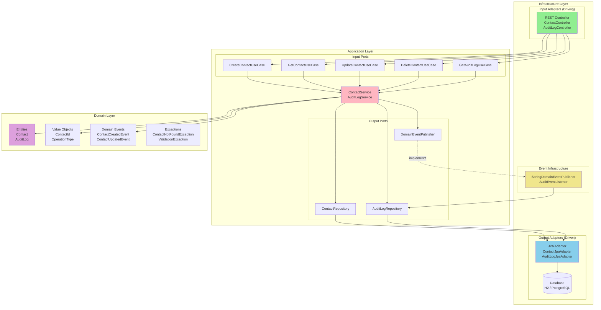
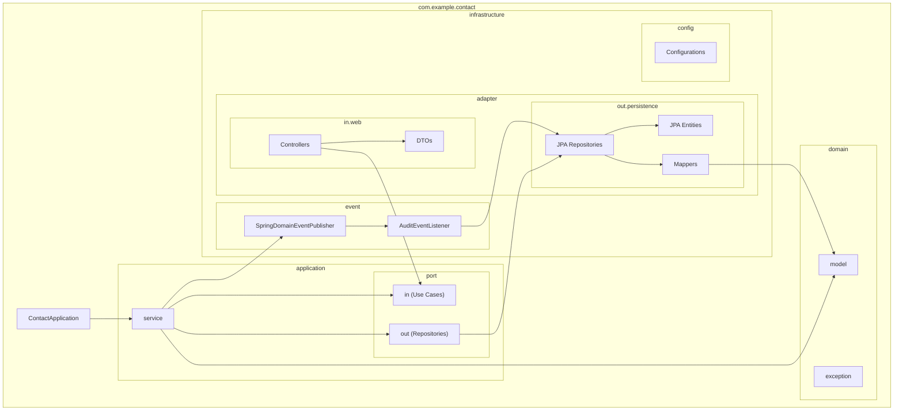
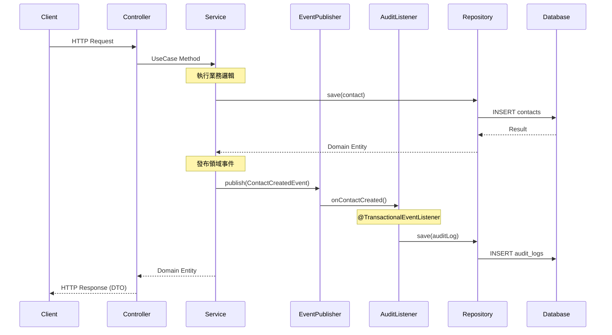
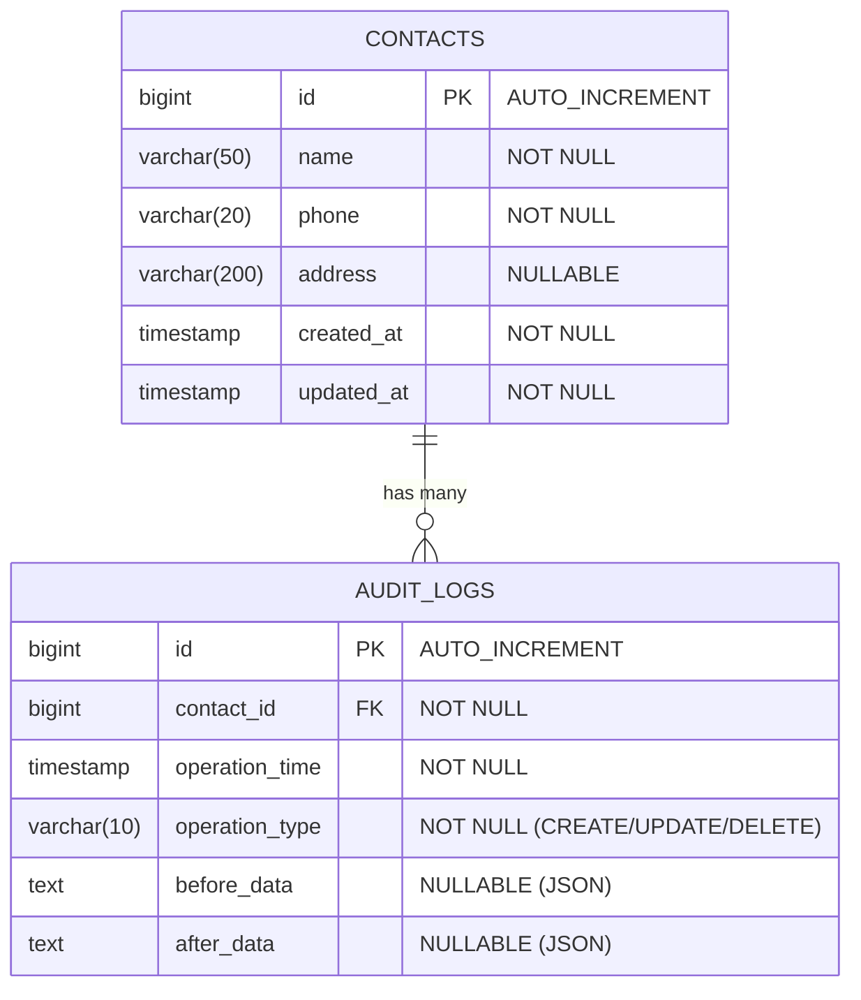
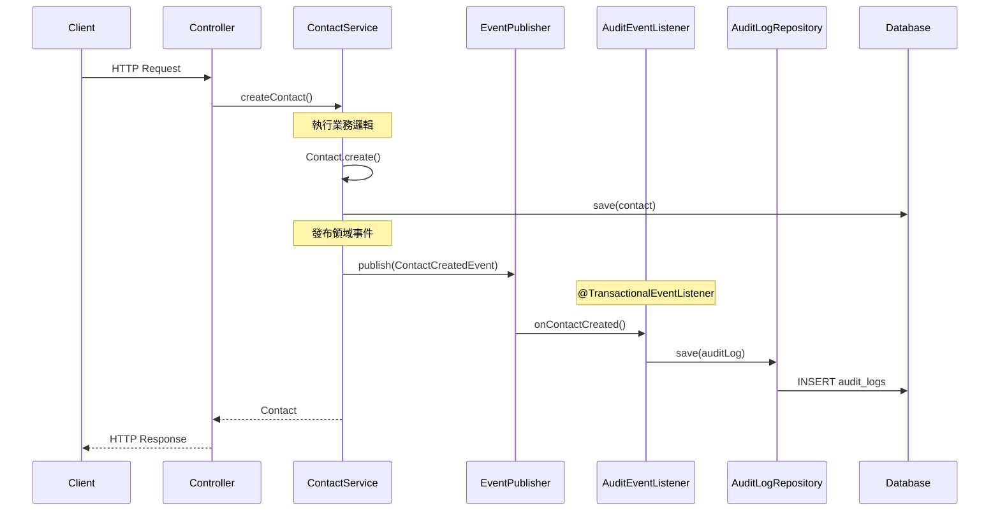
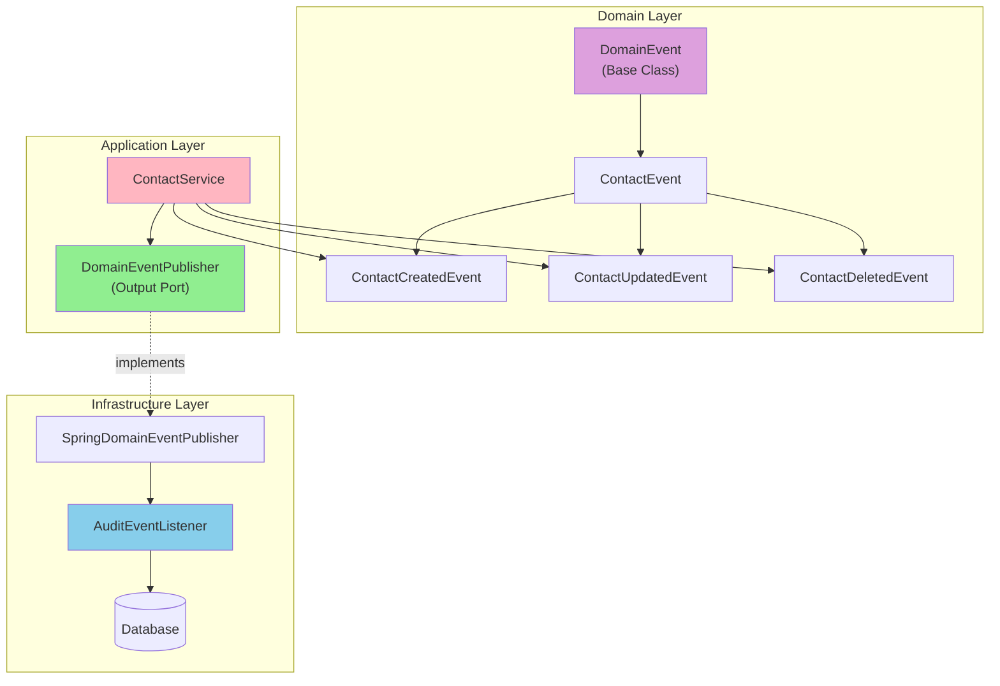

# 聯絡人管理系統 (Contact Management System)

基於六角形架構 (Hexagonal Architecture) 的 RESTful API 聯絡人管理系統，具備完整的 CRUD 操作與 Domain Events 自動稽核日誌功能。

---

## 分支說明

> **當前分支: `main`** - 使用 Domain Events 實作稽核機制（推薦）

本專案有兩個主要分支，分別展示不同的稽核架構實作方式：

| 分支 | 稽核機制 | 說明 |
|------|----------|------|
| **`main`** (此分支) | Domain Events | 使用領域事件 + `@TransactionalEventListener` |
| [`aop4audit`](https://github.com/ChunPingWang/aop-poc/tree/aop4audit) | Spring AOP | 使用 `@Auditable` 註解 + `AuditAspect` 攔截 |

### 兩種方式比較

| 比較項目 | Domain Events 方式 (此分支) | AOP 方式 (aop4audit) |
|---------|---------------------------|---------------------|
| **架構正確性** | ✅ 符合六角形架構依賴規則 | ⚠️ Application 依賴 Infrastructure |
| **耦合程度** | Service 完全不知道稽核存在 | Service 需標註 `@Auditable` |
| **資料記錄** | 業務層資訊 (before/after snapshot) | HTTP 層資訊 (endpoint, IP, userAgent) |
| **可測試性** | 輕鬆 Mock EventPublisher | 需處理 AOP 代理 |
| **擴展性** | 新增 EventListener | 修改 Aspect |
| **實作複雜度** | 較高，需定義事件類別 | 較低，快速上手 |
| **適用場景** | 大型專案、嚴格架構 | 快速原型、簡單專案 |

### 切換分支

```bash
# 切換到 AOP 版本
git checkout aop4audit

# 切換回 Domain Events 版本 (此分支)
git checkout main
```

---

## 專案狀態

| 項目 | 狀態 |
|------|------|
| 建置狀態 | ✅ BUILD SUCCESSFUL |
| 測試覆蓋 | ✅ 39 tests passed |
| API 文件 | ✅ Swagger UI 可用 |
| 開發環境 | ✅ H2 Console 可用 |

### 已實作功能

- [x] **US1**: 新增聯絡人 - POST /api/contacts
- [x] **US2**: 查詢聯絡人 - GET /api/contacts, GET /api/contacts/{id}
- [x] **US3**: 修改聯絡人 - PUT /api/contacts/{id}
- [x] **US4**: 刪除聯絡人 - DELETE /api/contacts/{id}
- [x] **US5**: 稽核日誌自動記錄 - Domain Events 自動處理
- [x] **US6**: 稽核日誌查詢 - GET /api/audit-logs
- [x] **US7**: H2 資料庫管理介面

## 技術棧

| 技術 | 版本 | 用途 |
|------|------|------|
| Java | 17 | 程式語言 |
| Spring Boot | 3.2.0 | 應用框架 |
| Spring Data JPA | 3.2.0 | 資料存取 |
| Spring Events | 3.2.0 | 領域事件發布 |
| H2 Database | - | 開發環境資料庫 |
| PostgreSQL | - | 生產環境資料庫 |
| Cucumber | 7.15.0 | BDD 測試 |
| Springdoc OpenAPI | 2.3.0 | API 文件 |
| Gradle | 8.5 | 建置工具 |

## 系統架構

### 架構依賴規則

本專案嚴格遵循六角形架構的依賴規則：

```
┌───────────────────────────────────────────────────────────────────┐
│                        依賴方向規則                                │
├───────────────────────────────────────────────────────────────────┤
│                                                                   │
│   Infrastructure Layer  ─────────────►  Application Layer         │
│          (可以依賴)                          (被依賴)              │
│                                                                   │
│   Application Layer     ─────────────►  Domain Layer              │
│          (可以依賴)                          (被依賴)              │
│                                                                   │
│   ✗ Application Layer   ──────X──────►  Infrastructure Layer      │
│          (禁止依賴)                                                │
│                                                                   │
│   ✗ Domain Layer        ──────X──────►  Application Layer         │
│          (禁止依賴)                                                │
│                                                                   │
└───────────────────────────────────────────────────────────────────┘
```

**核心原則**:
1. **Domain Layer** 為核心，不依賴任何外層
2. **Application Layer** 只依賴 Domain Layer，透過 Output Port (Interface) 與 Infrastructure 互動
3. **Infrastructure Layer** 可依賴 Application Layer 和 Domain Layer
4. 使用 **依賴反轉 (Dependency Inversion)** 確保內層不依賴外層

**實作方式**:
- Application Layer 定義 Output Port（如 `ContactRepository`、`DomainEventPublisher`）
- Infrastructure Layer 提供實作（如 `ContactJpaAdapter`、`SpringDomainEventPublisher`）
- 透過 Spring DI 在執行時綁定

### 六角形架構 (Hexagonal Architecture)



### 套件結構圖



### 請求處理流程



## ER Diagram



## 快速開始

### 環境需求

- JDK 17+
- Gradle 8.5+ (使用 wrapper 可略過)

### 啟動專案

```bash
# 1. Clone 專案
git clone <repository-url>
cd aop-poc

# 2. 建置專案
./gradlew build

# 3. 啟動應用程式 (開發環境)
./gradlew bootRun --args='--spring.profiles.active=dev'
```

### 存取服務

| 服務 | URL |
|------|-----|
| API Base URL | http://localhost:8080/api |
| Swagger UI | http://localhost:8080/swagger-ui.html |
| OpenAPI JSON | http://localhost:8080/v3/api-docs |
| H2 Console | http://localhost:8080/h2-console |

#### H2 Console 連線資訊

- JDBC URL: `jdbc:h2:mem:contactdb`
- Username: `sa`
- Password: (空白)

## API 使用指南

### 聯絡人 API

#### 1. 新增聯絡人

```bash
curl -X POST http://localhost:8080/api/contacts \
  -H "Content-Type: application/json" \
  -d '{
    "name": "王小明",
    "phone": "0912345678",
    "address": "台北市信義區信義路五段7號"
  }'
```

**回應範例 (201 Created):**

```json
{
  "id": 1,
  "name": "王小明",
  "phone": "0912345678",
  "address": "台北市信義區信義路五段7號",
  "createdAt": "2024-01-15T10:30:00",
  "updatedAt": "2024-01-15T10:30:00"
}
```

#### 2. 查詢所有聯絡人

```bash
curl -X GET http://localhost:8080/api/contacts
```

**回應範例 (200 OK):**

```json
[
  {
    "id": 1,
    "name": "王小明",
    "phone": "0912345678",
    "address": "台北市信義區信義路五段7號",
    "createdAt": "2024-01-15T10:30:00",
    "updatedAt": "2024-01-15T10:30:00"
  },
  {
    "id": 2,
    "name": "李小華",
    "phone": "0987654321",
    "address": "新北市板橋區文化路一段100號",
    "createdAt": "2024-01-15T11:00:00",
    "updatedAt": "2024-01-15T11:00:00"
  }
]
```

#### 3. 查詢單一聯絡人

```bash
curl -X GET http://localhost:8080/api/contacts/1
```

**回應範例 (200 OK):**

```json
{
  "id": 1,
  "name": "王小明",
  "phone": "0912345678",
  "address": "台北市信義區信義路五段7號",
  "createdAt": "2024-01-15T10:30:00",
  "updatedAt": "2024-01-15T10:30:00"
}
```

**錯誤回應 (404 Not Found):**

```json
{
  "timestamp": "2024-01-15T10:35:00",
  "status": 404,
  "error": "Not Found",
  "message": "聯絡人 ID 999 不存在"
}
```

#### 4. 修改聯絡人

```bash
curl -X PUT http://localhost:8080/api/contacts/1 \
  -H "Content-Type: application/json" \
  -d '{
    "name": "王大明",
    "phone": "0911222333",
    "address": "台北市大安區敦化南路二段100號"
  }'
```

**回應範例 (200 OK):**

```json
{
  "id": 1,
  "name": "王大明",
  "phone": "0911222333",
  "address": "台北市大安區敦化南路二段100號",
  "createdAt": "2024-01-15T10:30:00",
  "updatedAt": "2024-01-15T14:20:00"
}
```

#### 5. 刪除聯絡人

```bash
curl -X DELETE http://localhost:8080/api/contacts/1
```

**回應: 204 No Content** (無內容)

### 稽核日誌 API

#### 1. 查詢所有稽核日誌

```bash
curl -X GET http://localhost:8080/api/audit-logs
```

**回應範例 (200 OK):**

```json
[
  {
    "id": 3,
    "contactId": 1,
    "operationTime": "2024-01-15T14:20:00",
    "operationType": "UPDATE",
    "beforeData": "{\"id\":1,\"name\":\"王小明\",\"phone\":\"0912345678\",\"address\":\"台北市信義區\"}",
    "afterData": "{\"id\":1,\"name\":\"王大明\",\"phone\":\"0911222333\",\"address\":\"台北市大安區\"}"
  },
  {
    "id": 2,
    "contactId": 2,
    "operationTime": "2024-01-15T11:00:00",
    "operationType": "CREATE",
    "beforeData": null,
    "afterData": "{\"id\":2,\"name\":\"李小華\",\"phone\":\"0987654321\",\"address\":\"新北市板橋區\"}"
  },
  {
    "id": 1,
    "contactId": 1,
    "operationTime": "2024-01-15T10:30:00",
    "operationType": "CREATE",
    "beforeData": null,
    "afterData": "{\"id\":1,\"name\":\"王小明\",\"phone\":\"0912345678\",\"address\":\"台北市信義區\"}"
  }
]
```

#### 2. 依聯絡人 ID 查詢稽核日誌

```bash
curl -X GET http://localhost:8080/api/audit-logs/contact/1
```

**回應範例 (200 OK):**

```json
[
  {
    "id": 3,
    "contactId": 1,
    "operationTime": "2024-01-15T14:20:00",
    "operationType": "UPDATE",
    "beforeData": "{\"id\":1,\"name\":\"王小明\",\"phone\":\"0912345678\",\"address\":\"台北市信義區\"}",
    "afterData": "{\"id\":1,\"name\":\"王大明\",\"phone\":\"0911222333\",\"address\":\"台北市大安區\"}"
  },
  {
    "id": 1,
    "contactId": 1,
    "operationTime": "2024-01-15T10:30:00",
    "operationType": "CREATE",
    "beforeData": null,
    "afterData": "{\"id\":1,\"name\":\"王小明\",\"phone\":\"0912345678\",\"address\":\"台北市信義區\"}"
  }
]
```

#### 3. 依操作類型查詢稽核日誌

```bash
# 查詢所有 CREATE 操作
curl -X GET http://localhost:8080/api/audit-logs/operation/CREATE

# 查詢所有 UPDATE 操作
curl -X GET http://localhost:8080/api/audit-logs/operation/UPDATE

# 查詢所有 DELETE 操作
curl -X GET http://localhost:8080/api/audit-logs/operation/DELETE
```

### 驗證錯誤處理

當請求參數不符合驗證規則時，API 會回傳 400 Bad Request：

```bash
curl -X POST http://localhost:8080/api/contacts \
  -H "Content-Type: application/json" \
  -d '{
    "name": "",
    "phone": ""
  }'
```

**回應範例 (400 Bad Request):**

```json
{
  "timestamp": "2024-01-15T10:30:00",
  "status": 400,
  "error": "Bad Request",
  "message": "姓名為必填欄位; 電話為必填欄位"
}
```

## 完整使用情境範例

以下是一個完整的使用情境，展示從新增到刪除聯絡人的完整流程：

```bash
#!/bin/bash

BASE_URL="http://localhost:8080/api"

echo "=== 1. 新增第一位聯絡人 ==="
curl -s -X POST "$BASE_URL/contacts" \
  -H "Content-Type: application/json" \
  -d '{"name": "張三", "phone": "0912111222", "address": "台北市"}' | jq .

echo -e "\n=== 2. 新增第二位聯絡人 ==="
curl -s -X POST "$BASE_URL/contacts" \
  -H "Content-Type: application/json" \
  -d '{"name": "李四", "phone": "0923222333", "address": "新北市"}' | jq .

echo -e "\n=== 3. 查詢所有聯絡人 ==="
curl -s -X GET "$BASE_URL/contacts" | jq .

echo -e "\n=== 4. 查詢單一聯絡人 (ID=1) ==="
curl -s -X GET "$BASE_URL/contacts/1" | jq .

echo -e "\n=== 5. 修改聯絡人 (ID=1) ==="
curl -s -X PUT "$BASE_URL/contacts/1" \
  -H "Content-Type: application/json" \
  -d '{"name": "張三丰", "phone": "0912111222", "address": "台北市信義區"}' | jq .

echo -e "\n=== 6. 查詢稽核日誌 (聯絡人 ID=1) ==="
curl -s -X GET "$BASE_URL/audit-logs/contact/1" | jq .

echo -e "\n=== 7. 刪除聯絡人 (ID=2) ==="
curl -s -X DELETE "$BASE_URL/contacts/2" -w "HTTP Status: %{http_code}\n"

echo -e "\n=== 8. 查詢所有稽核日誌 ==="
curl -s -X GET "$BASE_URL/audit-logs" | jq .

echo -e "\n=== 9. 依操作類型查詢 (DELETE) ==="
curl -s -X GET "$BASE_URL/audit-logs/operation/DELETE" | jq .
```

## 開發指南

### 執行測試

```bash
# 執行所有測試
./gradlew test

# 執行測試並產生覆蓋率報告
./gradlew test jacocoTestReport

# 查看測試報告
open build/reports/tests/test/index.html

# 查看覆蓋率報告
open build/reports/jacoco/test/html/index.html
```

### 程式碼檢查

```bash
# 執行 Checkstyle
./gradlew checkstyleMain checkstyleTest

# 查看 Checkstyle 報告
open build/reports/checkstyle/main.html
```

### 完整建置

```bash
# 執行完整建置（編譯 + 測試 + 檢查）
./gradlew build
```

## 目錄結構

```
src/
├── main/
│   ├── java/com/example/contact/
│   │   ├── ContactApplication.java          # 應用程式進入點
│   │   ├── domain/                          # 領域層
│   │   │   ├── model/                       # 領域實體與值物件
│   │   │   │   ├── Contact.java
│   │   │   │   ├── ContactId.java
│   │   │   │   ├── AuditLog.java
│   │   │   │   └── OperationType.java
│   │   │   ├── event/                       # 領域事件
│   │   │   │   ├── DomainEvent.java
│   │   │   │   ├── ContactEvent.java
│   │   │   │   ├── ContactCreatedEvent.java
│   │   │   │   ├── ContactUpdatedEvent.java
│   │   │   │   └── ContactDeletedEvent.java
│   │   │   └── exception/                   # 領域例外
│   │   │       ├── ContactNotFoundException.java
│   │   │       └── ValidationException.java
│   │   ├── application/                     # 應用層
│   │   │   ├── port/
│   │   │   │   ├── in/                      # 輸入埠 (Use Cases)
│   │   │   │   └── out/                     # 輸出埠 (Repositories)
│   │   │   └── service/                     # 應用服務
│   │   │       ├── ContactService.java
│   │   │       └── AuditLogService.java
│   │   └── infrastructure/                  # 基礎設施層
│   │       ├── adapter/
│   │       │   ├── in/web/                  # 輸入適配器 (Controllers)
│   │       │   │   ├── ContactController.java
│   │       │   │   ├── AuditLogController.java
│   │       │   │   ├── GlobalExceptionHandler.java
│   │       │   │   └── dto/                 # 資料傳輸物件
│   │       │   └── out/persistence/         # 輸出適配器 (JPA)
│   │       │       ├── entity/              # JPA 實體
│   │       │       ├── ContactJpaAdapter.java
│   │       │       └── AuditLogJpaAdapter.java
│   │       ├── event/                       # 領域事件處理
│   │       │   ├── SpringDomainEventPublisher.java
│   │       │   └── AuditEventListener.java
│   │       └── config/                      # 配置類別
│   │           ├── OpenApiConfig.java
│   │           ├── WebConfig.java
│   │           └── PersistenceConfig.java
│   └── resources/
│       ├── application.yml                  # 共用配置
│       ├── application-dev.yml              # 開發環境配置
│       └── application-prod.yml             # 生產環境配置
└── test/
    ├── java/com/example/contact/
    │   ├── unit/                            # 單元測試
    │   └── integration/                     # 整合測試 (Cucumber)
    └── resources/
        ├── application.yml                  # 測試配置
        └── features/                        # Cucumber 功能檔案
            ├── contact-create.feature
            ├── contact-query.feature
            ├── contact-update.feature
            ├── contact-delete.feature
            ├── audit-log.feature
            └── audit-query.feature
```

## 稽核模組開發指引 (Domain Events 架構)

本專案使用 **Domain Events（領域事件）** 模式實作稽核機制，實現業務邏輯與稽核邏輯的**完全解耦**。

### 為什麼選擇 Domain Events？

| 比較項目 | AOP 方式 | Domain Events 方式 |
|---------|---------|-------------------|
| 耦合度 | Service 需依賴 @Auditable | Service 完全不知道稽核存在 |
| 可測試性 | 需 Mock AOP 相關元件 | 只需 Mock EventPublisher |
| 擴展性 | 修改 Aspect 程式碼 | 新增 EventListener 即可 |
| 符合 DDD | 部分符合 | 完全符合 |
| 交易一致性 | 同一交易 | 可選同步/非同步 |

### 架構概覽



### 核心元件



### 元件說明

| 元件 | 位置 | 說明 |
|------|------|------|
| `DomainEvent` | domain/event | 領域事件基底類別 |
| `ContactCreatedEvent` | domain/event | 聯絡人建立事件 |
| `ContactUpdatedEvent` | domain/event | 聯絡人更新事件 |
| `ContactDeletedEvent` | domain/event | 聯絡人刪除事件 |
| `DomainEventPublisher` | application/port/out | 事件發布器介面 (輸出埠) |
| `SpringDomainEventPublisher` | infrastructure/event | Spring 事件發布器實作 |
| `AuditEventListener` | infrastructure/event | 稽核事件監聽器 |

### 快速開始：為新實體添加稽核

#### 步驟 1：定義領域事件

```java
// 基底事件
public abstract class OrderEvent extends DomainEvent {
    private final Long orderId;
    private final Map<String, Object> snapshot;

    protected OrderEvent(Order order) {
        this.orderId = order.getId();
        this.snapshot = createSnapshot(order);
    }

    // getters...
}

// 具體事件
public class OrderCreatedEvent extends OrderEvent {
    public OrderCreatedEvent(Order order) {
        super(order);
    }
}

public class OrderUpdatedEvent extends OrderEvent {
    private final Map<String, Object> beforeSnapshot;

    public OrderUpdatedEvent(Order order, Map<String, Object> beforeSnapshot) {
        super(order);
        this.beforeSnapshot = beforeSnapshot;
    }
}
```

#### 步驟 2：在 Service 發布事件

```java
@Service
@Transactional
public class OrderService {

    private final OrderRepository orderRepository;
    private final DomainEventPublisher eventPublisher;

    public Order createOrder(CreateOrderCommand command) {
        Order order = Order.create(command);
        Order savedOrder = orderRepository.save(order);

        // 發布領域事件 - Service 不知道誰會處理這個事件
        eventPublisher.publish(new OrderCreatedEvent(savedOrder));

        return savedOrder;
    }

    public Order updateOrder(UpdateOrderCommand command) {
        Order order = orderRepository.findById(command.id())
            .orElseThrow(() -> new OrderNotFoundException(command.id()));

        Map<String, Object> beforeSnapshot = createSnapshot(order);
        order.update(command);
        Order updatedOrder = orderRepository.save(order);

        eventPublisher.publish(new OrderUpdatedEvent(updatedOrder, beforeSnapshot));

        return updatedOrder;
    }
}
```

#### 步驟 3：建立事件監聽器

```java
@Component
public class OrderAuditEventListener {

    private final AuditLogRepository auditLogRepository;
    private final ObjectMapper objectMapper;

    @TransactionalEventListener(phase = TransactionPhase.BEFORE_COMMIT)
    public void onOrderCreated(OrderCreatedEvent event) {
        AuditLog auditLog = AuditLog.create(
            event.getOrderId(),
            OperationType.CREATE,
            null,
            toJson(event.getSnapshot())
        );
        auditLogRepository.save(auditLog);
    }

    @TransactionalEventListener(phase = TransactionPhase.BEFORE_COMMIT)
    public void onOrderUpdated(OrderUpdatedEvent event) {
        AuditLog auditLog = AuditLog.create(
            event.getOrderId(),
            OperationType.UPDATE,
            toJson(event.getBeforeSnapshot()),
            toJson(event.getSnapshot())
        );
        auditLogRepository.save(auditLog);
    }
}
```

### @TransactionalEventListener 參數

| 參數 | 說明 |
|------|------|
| `BEFORE_COMMIT` | 在交易提交前執行（同一交易） |
| `AFTER_COMMIT` | 在交易提交後執行（新交易） |
| `AFTER_ROLLBACK` | 在交易回滾後執行 |
| `AFTER_COMPLETION` | 在交易完成後執行（無論成功或失敗） |

### 進階用法

#### 非同步處理

```java
@Component
public class AsyncAuditEventListener {

    @Async
    @TransactionalEventListener(phase = TransactionPhase.AFTER_COMMIT)
    public void onContactCreated(ContactCreatedEvent event) {
        // 非同步處理，不阻塞主交易
        // 適合發送通知、同步到外部系統等
    }
}
```

#### 多個監聽器

```java
// 稽核日誌
@Component
public class AuditEventListener {
    @TransactionalEventListener
    public void onContactCreated(ContactCreatedEvent event) {
        // 寫入稽核日誌
    }
}

// 通知服務
@Component
public class NotificationEventListener {
    @Async
    @TransactionalEventListener(phase = TransactionPhase.AFTER_COMMIT)
    public void onContactCreated(ContactCreatedEvent event) {
        // 發送通知
    }
}

// 搜尋索引
@Component
public class SearchIndexEventListener {
    @Async
    @TransactionalEventListener(phase = TransactionPhase.AFTER_COMMIT)
    public void onContactCreated(ContactCreatedEvent event) {
        // 更新搜尋索引
    }
}
```

### 檔案結構

```
src/main/java/com/example/contact/
├── domain/
│   └── event/                              # 領域事件
│       ├── DomainEvent.java                # 事件基底類別
│       ├── ContactEvent.java               # Contact 事件基底
│       ├── ContactCreatedEvent.java        # 建立事件
│       ├── ContactUpdatedEvent.java        # 更新事件
│       └── ContactDeletedEvent.java        # 刪除事件
├── application/
│   └── port/out/
│       └── DomainEventPublisher.java       # 事件發布器介面
└── infrastructure/
    └── event/
        ├── SpringDomainEventPublisher.java # Spring 事件發布器
        └── AuditEventListener.java         # 稽核事件監聽器
```

### 最佳實踐

1. **事件命名**
   - 使用過去式動詞：`Created`、`Updated`、`Deleted`
   - 清楚表達「發生了什麼」

2. **事件內容**
   - 包含足夠資訊讓監聽器能獨立處理
   - 避免在事件中包含複雜物件參照

3. **交易策略**
   - 稽核日誌：`BEFORE_COMMIT`（確保一致性）
   - 通知/索引：`AFTER_COMMIT`（避免虛假通知）

4. **錯誤處理**
   - `BEFORE_COMMIT` 失敗會導致整個交易回滾
   - `AFTER_COMMIT` 失敗不影響主交易

5. **效能考量**
   - 長時間操作使用 `@Async`
   - 大量事件考慮批次處理

## 授權

MIT License
